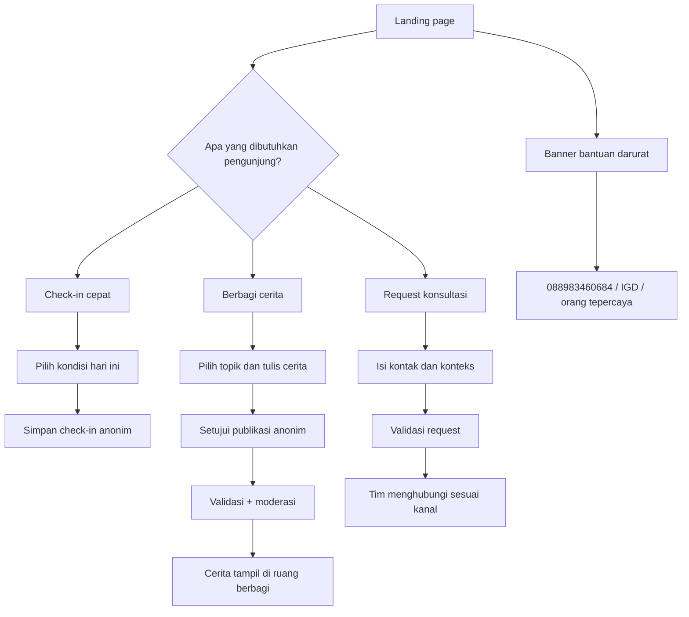

# Flow dan skema tabsipakarcinta

## 1. Tujuan produk

tabsipakarcinta adalah landing page sekaligus pintu masuk ke ruang aman untuk Gen Z yang ingin:

1. melakukan check-in singkat;
2. membagikan cerita tanpa nama; atau
3. meminta sesi percakapan awal dengan pendamping.

Produk ini bukan alat diagnosis dan bukan pengganti psikolog, psikiater, atau layanan darurat.

## 2. User flow



## 3. Arsitektur teknis

```text
Browser
  ├─ public/index.html       landing page dan content structure
  ├─ public/styles.css       responsive visual system
  └─ public/app.js           fetch API, form state, menu, reveal animation
          │
          ▼
Node.js HTTP server
  ├─ GET  /api/resources
  ├─ GET  /api/stories
  ├─ POST /api/check-ins
  ├─ POST /api/share
  ├─ POST /api/consultations
  └─ GET  /api/health
          │
          ▼
Demo storage: data/*.json
Production storage: SQLite/PostgreSQL sesuai schema.sql
```

## 4. API contract

### `POST /api/share`

```json
{
  "topic": "Burnout",
  "message": "Aku sedang belajar memberi jeda...",
  "consent": true
}
```

Cerita tidak menyimpan nama. Demo menyimpan status implisit; produksi perlu memasukkan post ke antrian moderasi sebelum publikasi.

### `POST /api/consultations`

```json
{
  "name": "Ara",
  "contact": "ara@example.com",
  "topic": "Overthinking",
  "channel": "Email",
  "message": "Aku ingin membicarakan..."
}
```

Data kontak hanya untuk follow-up layanan. Jangan dipakai untuk newsletter tanpa consent terpisah.

### `POST /api/check-ins`

```json
{
  "mood": "Butuh jeda"
}
```

Check-in demo tidak mengikat identitas user. Jika analytics ditambahkan, gunakan session ID acak dan jelaskan retensi datanya.

## 5. Guardrail yang wajib sebelum produksi

- Tambahkan moderasi otomatis + human review untuk cerita publik.
- Tambahkan rate limiting, CSRF protection, request logging yang tidak menyimpan isi curhat, dan validasi server-side yang lebih ketat.
- Enkripsi data kontak saat transit dan saat tersimpan; batasi akses dashboard pendamping dengan role-based access.
- Buat SOP eskalasi untuk indikasi self-harm, kekerasan, atau bahaya langsung.
- Tampilkan nomor bantuan berdasarkan negara/region user setelah diverifikasi; nomor di landing page saat ini adalah CTA Indonesia.
- Tambahkan consent, retention policy, privacy policy, dan jalur penghapusan data.
